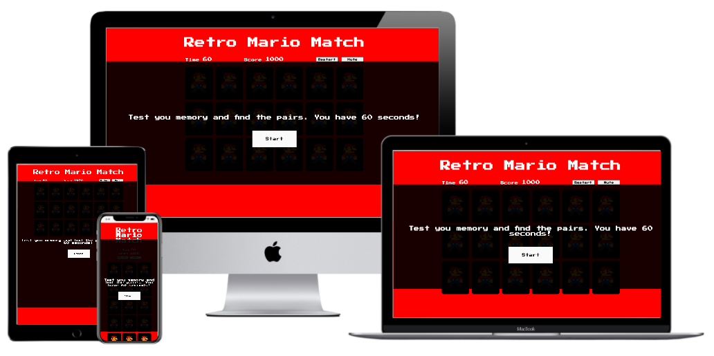

# Retro Mario Match

### MS2 -Interactive Frontend Development - Code Institute

This project a memory card Super Mario theme based. The idea is that the user will match all the card pairs in order to finish the game. There is a time limit of 60 seconds and a score of 1000 points to which every click deducts 20 points. 

## Demo

Click <a href="https://mendesfsweden.github.io/MilestoneProject2/">here</a> for a live demo version of this project.

## Technologies Used

<ul>
  <li>HTML - was used create the website structure</li>
  <li>CSS - was used to style the HTML</li>
  <li>JavaScript - was used for the website interactiveness</li>
  <li>Figma - was used to create the wireframes</li>
</ul>
  
## Features

The user is able to restart the game at any moment as well as disable/enable the sound, by clicking on the "Restart" and "Mute"/"Unmute" buttons, respectively.
The remaining playing time and score are visible at all times. 
Once the user loses or wins the game there are buttons available to restart the game. 

## Features Left To Implement

Create different dificulty levels. 

## Wireframes
The following wireframes for this projects were developed with <a href="https://www.figma.com/">Figma</a>:

<a href="https://github.com/mendesfsweden/MilestoneProject2/blob/master/assets/mockups/Desktop.pdf">Desktop Version</a> 
<a href="https://github.com/mendesfsweden/MilestoneProject2/blob/master/assets/mockups/Mobile.pdf">Mobile Version</a>

## Testing

This project was tested on Chrome, Safari, Edge, Brave, iOS devices (iPhone Xs and Ipad) and Android. All functionalities work as expected.
It does not work properly on Internet Explorer.

## Deployment
 
The project is hosted at GitHub, directly from the master branch. For that reason, any new changes committed will be deployed automatically.

## Credits

### Media

All images are from the free stock image library <a href="https://www.pngguru.com/" target="_blank">pngGuru</a>.

### Acknowledgements

Retro Mario Match was inspired on this GitHub repository <a href="https://github.com/portexe/Mix-Or-Match/" target="_blank">link</a>.
